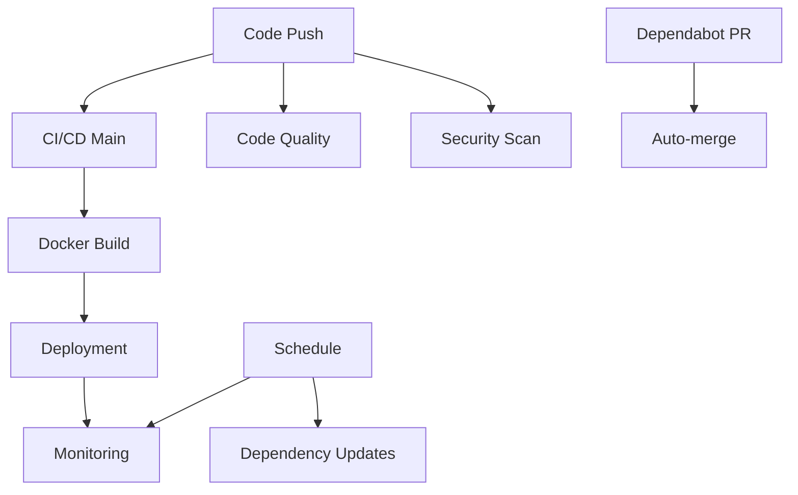

# 🏥 Hospital Management System - GitHub Actions Workflows

## 📋 Overview

Hệ thống GitHub Actions được thiết kế đặc biệt cho Hospital Management System với kiến trúc microservices, đảm bảo chất lượng code, bảo mật, và tuân thủ HIPAA.

## 🔄 Workflows

### 1. Main CI/CD Pipeline (`ci-cd-main.yml`)
**Trigger:** Push to main/develop/thien, Pull Requests
- ✅ Detect changes in frontend/backend
- 🏗️ Build và test tất cả microservices
- 🧪 Integration tests
- 🔒 Security scanning
- 📊 Build summary

### 2. Docker Build & Push (`docker-build.yml`)
**Trigger:** Push to main/develop, Tags, Manual
- 🐳 Build Docker images cho tất cả services
- 📦 Multi-architecture builds (amd64, arm64)
- 🔍 Container security scanning
- 🗂️ Image registry management

### 3. Security Scanning (`security.yml`)
**Trigger:** Push, Pull Requests, Daily schedule
- 🔐 Secret scanning (TruffleHog, GitLeaks)
- 📦 Dependency vulnerability checks
- 🔍 SAST analysis (CodeQL)
- 🏥 HIPAA compliance checks
- 🏗️ Infrastructure security

### 4. Code Quality (`code-quality.yml`)
**Trigger:** Push, Pull Requests
- 🧹 ESLint & Prettier checks
- 📝 TypeScript type checking
- 📊 Code complexity analysis
- 📚 Documentation quality
- ⚡ Performance checks

### 5. Deployment Pipeline (`deployment.yml`)
**Trigger:** Push to main, Tags, Manual
- 🚀 Multi-environment deployment (dev/staging/prod)
- 🗄️ Database migrations
- 🏥 Health checks
- 🔄 Blue-green deployment
- 📈 Post-deployment monitoring

### 6. Monitoring & Maintenance (`monitoring.yml`)
**Trigger:** Scheduled (15min, daily, weekly)
- 💓 Health monitoring
- ⚡ Performance analysis
- 📦 Dependency updates
- 🏥 HIPAA compliance monitoring
- 📊 Resource monitoring

### 7. Auto-merge Dependabot (`auto-merge.yml`)
**Trigger:** Dependabot PRs
- 🤖 Auto-approve minor/patch updates
- ⚠️ Manual review for major updates
- ✅ CI checks validation

### 8. Qodana Code Quality (`qodana.yml`, `qodana_code_quality.yml`)
**Trigger:** Push, Pull Requests
- 🔍 Advanced code analysis
- 📊 Quality metrics
- 🐛 Bug detection

## 🔧 Configuration Files

### Dependabot (`dependabot.yml`)
- 📦 Automated dependency updates
- 🗓️ Scheduled updates per service
- 🏷️ Proper labeling and assignment
- 🔒 Security-focused ignore rules

### Issue Templates
- 🐛 **Bug Report** (`bug_report.yml`): Structured bug reporting
- ✨ **Feature Request** (`feature_request.yml`): Feature suggestion template

### Pull Request Template
- 📋 **PR Template** (`PULL_REQUEST_TEMPLATE.md`): Comprehensive PR checklist

## 🏥 Healthcare-Specific Features

### HIPAA Compliance
- 🔒 Patient data handling checks
- 📝 Audit logging verification
- 🛡️ Access control validation
- 🔐 Encryption status monitoring

### Security Focus
- 🔍 Vulnerability scanning
- 🔐 Secret detection
- 🏗️ Infrastructure security
- 📊 Compliance reporting

## 🚀 Getting Started

### Required Secrets
```bash
# Supabase
SUPABASE_URL
SUPABASE_SERVICE_ROLE_KEY
SUPABASE_ANON_KEY

# Environment-specific
STAGING_SUPABASE_URL
STAGING_SUPABASE_SERVICE_ROLE_KEY
PROD_SUPABASE_URL
PROD_SUPABASE_SERVICE_ROLE_KEY

# Frontend
NEXT_PUBLIC_SUPABASE_URL
NEXT_PUBLIC_SUPABASE_ANON_KEY

# Security Tools
SNYK_TOKEN
QODANA_TOKEN
GITLEAKS_LICENSE

# Container Registry
GITHUB_TOKEN (automatic)
```

### Environment Setup
1. Configure secrets in GitHub repository settings
2. Enable GitHub Actions
3. Set up branch protection rules
4. Configure environments (development, staging, production)

## 📊 Monitoring & Alerts

### Health Checks
- ⏰ Every 15 minutes
- 🏥 All microservices
- 🗄️ Database connectivity
- 🔗 External dependencies

### Performance Monitoring
- 📈 Weekly analysis
- 🔍 Lighthouse audits
- ⚡ API performance
- 🗄️ Database metrics

### Security Monitoring
- 🔒 Daily vulnerability scans
- 🔐 Secret detection
- 🏥 HIPAA compliance checks
- 📊 Security reports

## 🔄 Workflow Dependencies



## 🏷️ Labels & Organization

### Component Labels
- `frontend`, `backend`, `api-gateway`, `auth-service`
- `doctor-service`, `patient-service`, `appointment-service`
- `medical-records-service`, `payment-service`

### Type Labels
- `bug`, `enhancement`, `feature`, `security`
- `dependencies`, `ci/cd`, `documentation`

### Priority Labels
- `critical`, `high-priority`, `medium`, `low`

## 📚 Best Practices

### Code Quality
- ✅ All checks must pass before merge
- 🧪 Comprehensive test coverage
- 📝 Proper documentation
- 🔒 Security considerations

### Healthcare Compliance
- 🏥 HIPAA compliance mandatory
- 📝 Audit logging required
- 🔒 Patient data protection
- 🛡️ Access control enforcement

### Deployment
- 🔄 Blue-green deployment for production
- 🧪 Staging environment testing
- 📊 Health checks post-deployment
- 🔄 Rollback capabilities

## 🆘 Troubleshooting

### Common Issues
1. **Build Failures**: Check service dependencies
2. **Test Failures**: Verify environment variables
3. **Security Alerts**: Review and fix immediately
4. **Deployment Issues**: Check health endpoints

### Support
- 📧 Create GitHub issue with appropriate template
- 🏷️ Use proper labels for categorization
- 📋 Follow PR template for contributions

---

**Note:** This system is designed for a healthcare environment with strict compliance requirements. All changes must consider patient privacy and HIPAA regulations.
